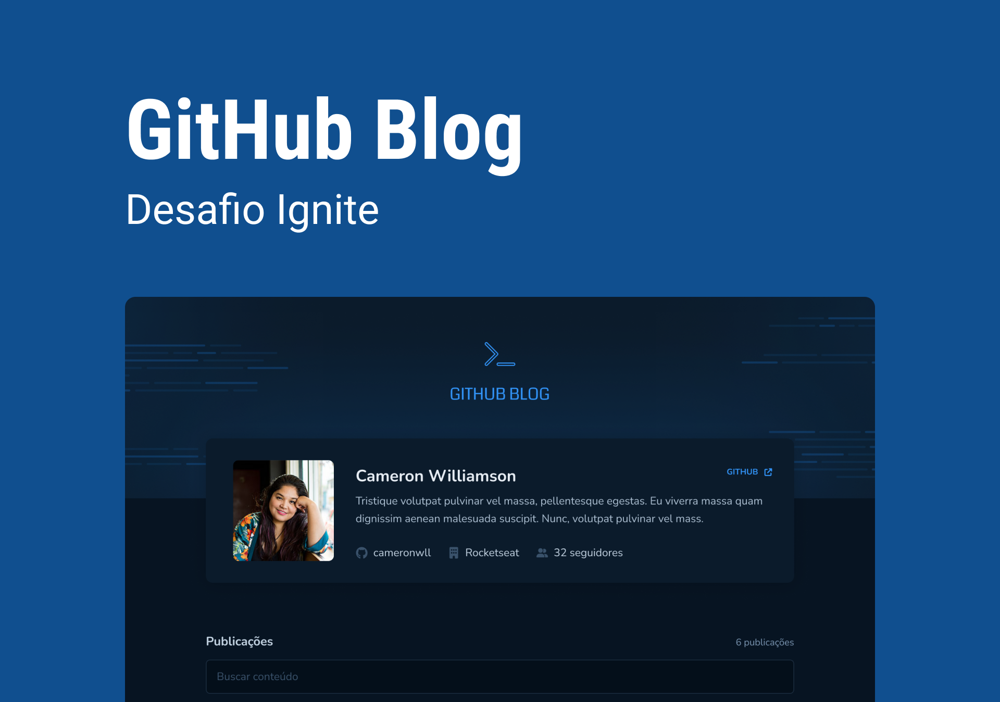

# GitHub Blog

# Rocketseat Ignite React Desafio GitHub Blog

Blog utilizando das issues do repositório e da api do GitHub para simular posts

## Tech Stack

- [Typescript](https://www.typescriptlang.org)
- [React](https://reactjs.org)
- [Vite](https://vitejs.dev)
- [Styled Components](https://styled-components.com)
- [React Router DOM](https://reactrouter.com)
- [SWR](https://swr.vercel.app)
- [Axios](https://axios-http.com)
- [React Markdown](https://github.com/remarkjs/react-markdown)
- [React Syntax Highlighter](https://github.com/react-syntax-highlighter/react-syntax-highlighter)
- [Fontawesome](https://fontawesome.com)
